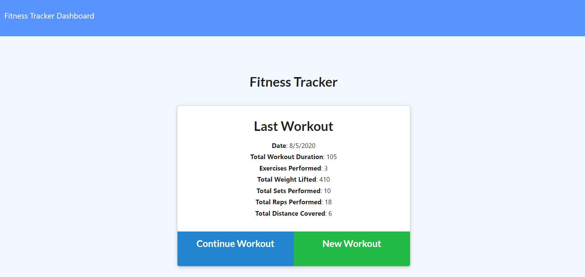

# Fitness-Tracker

## Code

This application is used to keep track of fitness workouts. The workouts can either be cardio or resistance training. 
The front end was completed by a third party, but I received the duty of writing the backend code. MongoDB and Mongoose were used to create a database
which keeps track of user information. Express.js was used for html routing and database extraction and entry. The front
end code was analyzed in order to comprehend what needed to be done on the backend. A custom method was added to obtain the total workout duration.

## Screenshot

## Heroku Deployment
[Click here](https://cnm-2020-fitness-tracker.herokuapp.com/) to use the deployed application.